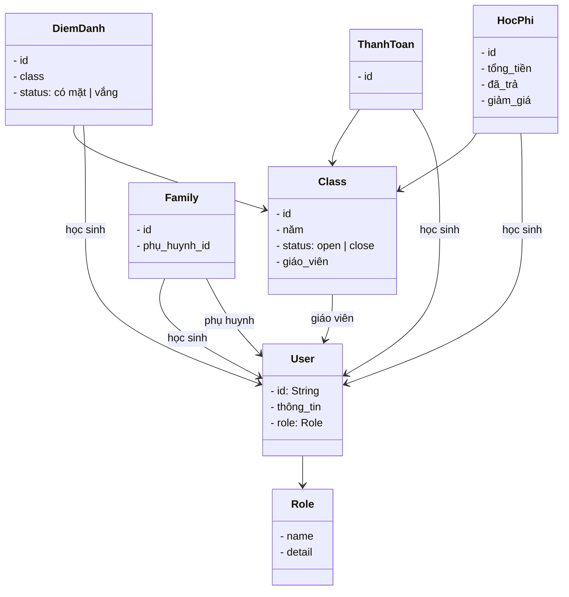

## class `user` {

    id string
    thong tin
    role
}
---
## class `role` {

    name
    detail
}

---
## class `class` {

    id 
    class name ("3.1","3.2",...)
    nam (2018,...)
    status <open ,close>
    giao vien
    list hoc sinh
}

---
## class `diem danh` {

    id
    class
    list hoc sinh
    date time
    status <co mat, vang>
}

---
## class `thanh toan` {

    id
    list class
    list student
}

---
## class `hoc phi` {

    id
    list student
    list class
    tong tien
    da tra
    giam gia?

}

---
## class `family` {

    id
    parent_id
    list student_id

}
----

#  Vai trò (Role)

## ADMIN

- Mở/đóng lớp tiếng Anh (ok)
- Quản lý lớp (giáo viên dạy, số học sinh, thông tin phụ huynh) (ok)
- Thêm lớp lên trang chủ (ok)
- Thống kê:
  - Số tiền trả cho giáo viên (ok)
  - Số tiền học sinh đóng 
    - Dự kiến (dựa theo số buổi)
    - Danh sách học sinh chưa đóng
    - Số tiền thực tế học sinh đã đóng
  - Thống kê theo quý, năm, tháng
  - Xem được số lượng học sinh thay đổi theo từng tháng

---

## GIÁO VIÊN

- Biết mình dạy lớp nào (thông tin lớp)
- Biết số buổi đã dạy mỗi lớp
- Điểm danh học sinh
- Gửi thông báo đến phụ huynh:
  - Về học sinh
  - Về học phí

---

## PHỤ HUYNH

- Biết con học lớp nào
- Số buổi con đã học/nghỉ (có chi tiết)
- Số tiền học phí mỗi tháng chưa đóng
- Tổng số tiền chưa đóng

---

## HỌC SINH

- Biết mình học lớp nào (thông tin lớp)
- Đã học bao nhiêu buổi <-lấy từ bảng điểm danh
- Đã nghỉ bao nhiêu buổi

---

# Sơ đồ lớp

# Thành viên tham gia dự án

| Thành viên |       Vai trò        |
| :--------: | :------------------: |
| **Phong**  |  Backend Developer   |
|  **Hải**   |  Frontend Developer  |
|  **Hiếu**  | Full Stack Developer |

